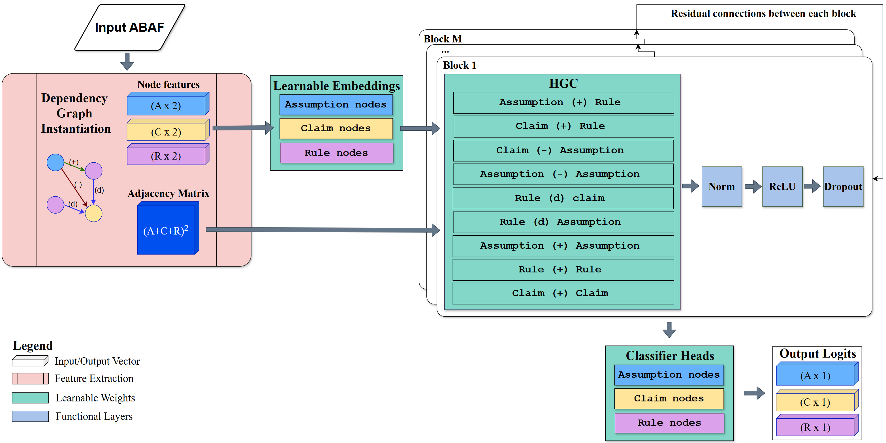

# GNN4ABA

**GNN4ABA** enables fast, accurate prediction of accepted assumptions in Assumption-Based Argumentation (ABA) frameworks using pre-trained Graph Neural Network (GNN) models (GCN and GAT). 

- **Instantly predict** which assumptions are accepted in your ABA files using our provided, ready-to-use models—no training required.
- **Build extensions** and analyze argumentation frameworks directly from the command line or Python.

For researchers and practitioners, GNN4ABA also provides a fully reproducible pipeline for:
- Generating and processing ABA dependency graphs
- Training and tuning GCN/GAT models on custom data
- Visualizing, evaluating, and comparing results

All experiments are designed for reproducibility, with scripts and environment files included for seamless setup and extension.

---

## 📖 Background

This project focuses on applying deep learning—specifically, Graph Neural Networks (GNNs)—to structured argumentation problems modeled as ABA frameworks. The pipeline includes:

1. **Generating and processing ABA dependency graphs** from raw data files in ICCMA format.
2. **Converting ABA frameworks into heterogeneous DGL graphs** with node and edge features.
3. **Training GCN and GAT models** to predict properties of arguments or frameworks.
4. **Evaluating and visualizing model performance** on various test splits.

The codebase supports reproducible experiments, hyperparameter sweeps, and detailed result analysis.

---


*Figure: High-level architecture of the GCN/GAT models used in GNN4ABA.*

---

## 💡 Key Features

- **Predict Accepted Assumptions:**  
  Instantly predict credulously accepted assumptions in ABA frameworks using pre-trained GCN or GAT models—no training required.

- **Construct Extensions:**  
  Build ABA extensions by iteratively selecting accepted assumptions, leveraging the model’s predictions for practical reasoning tasks.

- **Flexible Graph and Data Handling:**  
  - Parse ABA frameworks from plain-text files.
  - Convert frameworks into graph representations suitable for GNNs.

- **Custom Training and Hyperparameter Tuning:**  
  - Train your own GCN or GAT models on custom datasets.
  - Easily tune hyperparameters and evaluate model performance.

---

## 🚀 Installation

```bash
git clone https://github.com/yourusername/GNN4ABA.git
cd GNN4ABA
```
We recommend using [conda](https://docs.conda.io/en/latest/miniconda.html) for environment management since some of the packages have specific dependencies for Python 3.11. Config `environment.yml` is provided.

Create and activate the environment:
```bash
conda env create -f environment.yml
conda activate gnn4aba
```

---

## ⚡ Quickstart Examples

### 1. Predict Accepted Assumptions

**From the command line:**
```bash
python scr/predict_acceptance.py --model_type gat --aba_file data/flat_s10_c0.03_n0_a0.4_r2_b4_1.aba 
```
- Use `--model_type gcn` for the GCN model.
- Use `--no-print` to suppress printing and only return the list in Python.


### 2. Construct an Extension

**From the command line:**
```bash
python scr/extension_generator.py --model_type gcn --aba_file data/flat_s10_c0.03_n0_a0.4_r2_b4_1.aba 
```
- Use `--model_type gat` for the GAT model.

---

## 🔬 Reproduce Experiments (Training & Tuning)

To reproduce the main experiments:

1. **Generate ABA Frameworks:**
   - Use `data/data_generation.py` to create ABA framework files.
   - Example:
     ```bash
     python data/data_generation.py flat -aba ./output_data_generated
     ```
   - Parameters:
     - `file_id`: Root name for the output files (required, positional argument)
     - `-aba`: Directory for ABA framework files (required)
     - `-asp`: Directory for ASP files (optional) - only needed if you want ASP format files in addition to ABA files
   - This creates ABA framework files that can be used for training. Only ABA files are needed for the data processing step.

2. **Process Data:**
   - Use `scr/data_utils.py` to process ABA framework files and create DGL graph datasets.
   - Example:
     ```bash
     python scr/data_utils.py
     ```
   - This will create `.bin` files for training and testing in the root directory.

2. **Train a Model:**
   - Run the training script for GCN or GAT:
     ```bash
     python scr/train.py --model_type gcn --epochs 250 --output_folder results_final_gcn
     ```
   - Use `--model_type gat` for the GAT model.
      - `--epochs` sets the number of training epochs (default: 250).
      - `--output_folder` sets the output directory for results (default: results_final_gcn or results_final_gat).

3. **Hyperparameter Tuning:**
   - Use `scr/hyperparam_tune.py` to launch a wandb sweep for GCN or GAT:
     ```bash
     python scr/hyperparam_tune.py
     ```

4. **View Results:**
   - Training logs, model checkpoints, and plots are saved in `results_final_gcn/` and `results_final_gat/`.
   - Use the provided plotting scripts (e.g., `scr/plot_metrics.py`) to visualize training and evaluation metrics.

*Note: Full experiments may require significant compute time and disk space, especially with large datasets.*

---

## 📂 Repo structure

```text
GNN4ABA/
|-- data/                        # Data generation and sample files
|   |-- data_generation.py       # ABA framework generation script
|   |-- train_test_splits/       # CSVs with Train/test split details
|   |-- flat_s10_c0.03_n0_a0.4_r2_b4_1.aba  # Sample ABA framework
|   |-- output_flat_s10_c0.03_n0_a0.4_r2_b4_1.aba  # Sample output
|-- results_final_gcn/           # GCN model results and artifacts
|-- results_final_gat/           # GAT model results and artifacts
|-- scr/                         # Source code
|   |-- train.py                 # Main training script
|   |-- hyperparam_tune.py       # Hyperparameter sweep script
|   |-- hyperparam_trainer.py    # Training utilities
|   |-- data_utils.py            # Data processing and utilities
|   |-- dependency_graph.py      # ABA dependency graph construction
|   |-- GCN.py                   # Basic GCN model definition
|   |-- GCN_learnable.py         # Learnable GCN model definition
|   |-- GAT_learnable.py         # Learnable GAT model definition
|   |-- gcn_learnable_params     # GCN hyperparameter configurations
|   |-- gat_learnable_params     # GAT hyperparameter configurations
|   |-- plot_metrics.py          # Plotting utilities
|   |-- plot_graphs.py           # Graph visualization
|   |-- predict_acceptance.py    # Acceptance prediction script
|   |-- extension_generator.py   # Extension construction script
|   |-- aba_inference.py         # ABA inference engine
|   |-- hetero_graph_utils.py    # Heterogeneous graph utilities
|   |-- metrics.py               # Evaluation metrics
|-- tests/                       # Unit tests and example outputs
|-- model_architecture.png       # Model architecture diagram
|-- environment.yml              # Conda environment file
|-- README.md                    # This file
```

